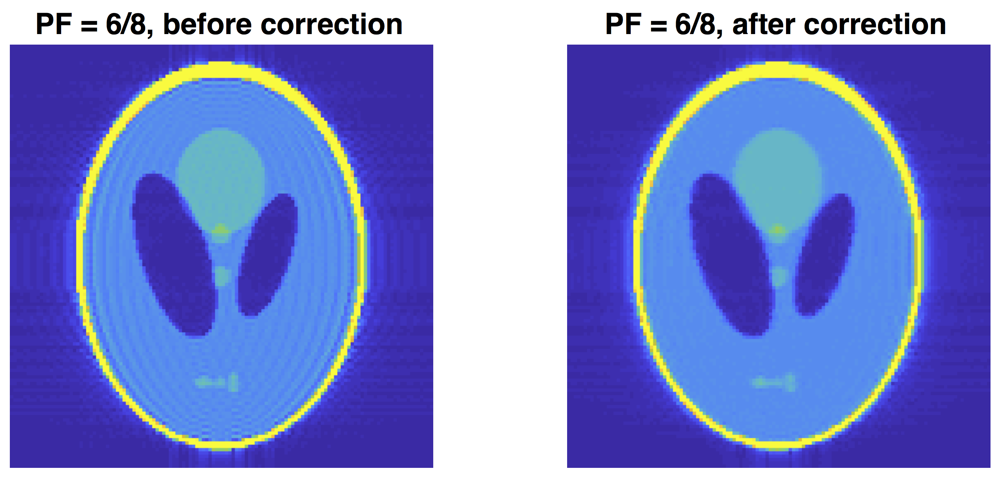

# Removal of Partial-fourier induced Gibbs ringing (RPG)

The partial-Fourier induced Gibbs ringing is composed of ringings with two periods. This code removes partial-Fourier induced Gibbs ringing by applying [Kellner et al.'s](https://doi.org/10.1002/mrm.26054) algorithm twice.

## References
* ** **
  - []

## Authors
* [Hong-Hsi Lee](http://www.diffusion-mri.com/people/hong-hsi-lee)
* [Els Fieremans](http://www.diffusion-mri.com/people/els-fieremans)
* [Dmitry S Novikov](http://www.diffusion-mri.com/people/dmitry-novikov)

## License
This project is licensed under the [LICENSE](https://github.com/NYU-DiffusionMRI/rpg-degibbs/blob/master/LICENSE).
